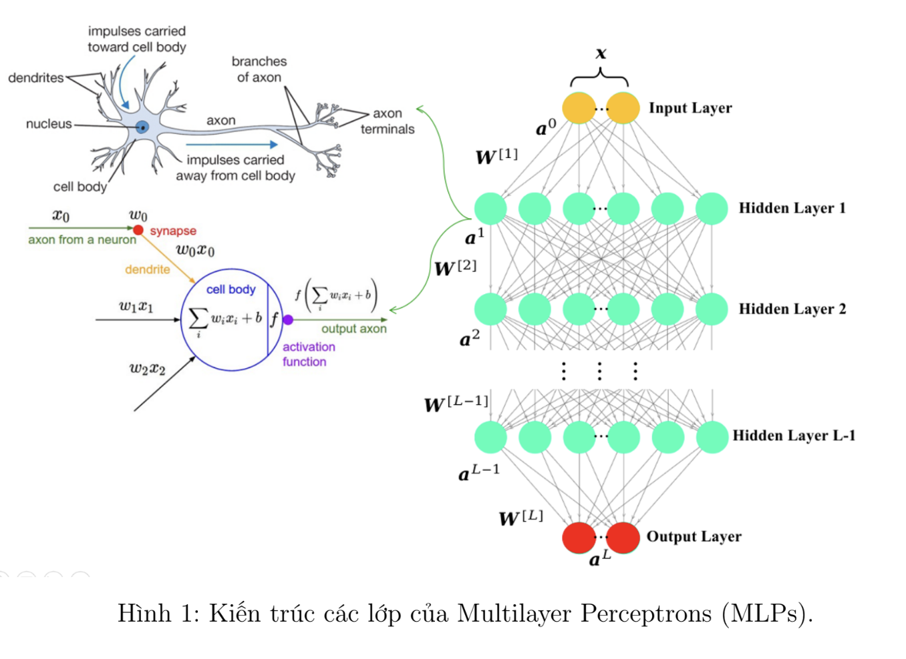
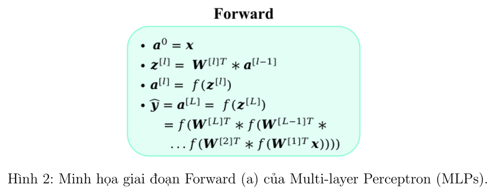
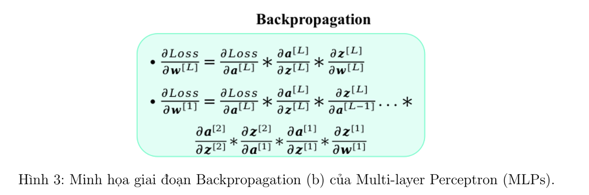
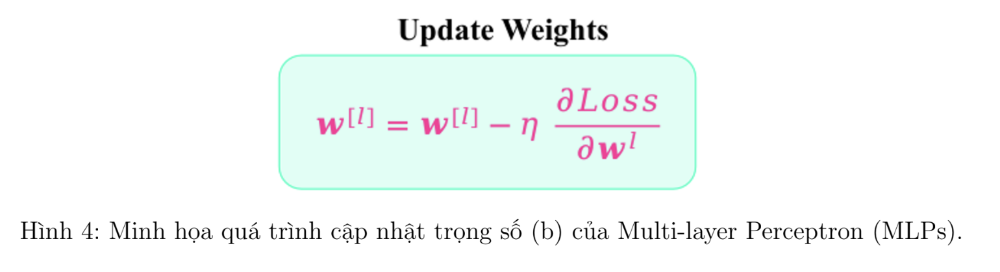
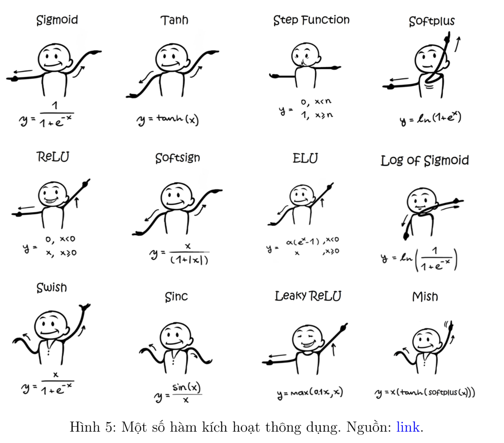

# Multilayer_Perceptron_And_Activation_Function
I. Giới thiệu

Multilayer Perceptrons (MLPs) là một kiến trúc mạng nơ-ron trong lĩnh vực học sâu (deep
learning) với cấu tạo gồm 3 thành phần chính: Lớp đầu vào (Input layer), Lớp ẩn (Hidden layer)
và Lớp đầu ra (Output layer). Mỗi lớp ẩn sử dụng hàm kích hoạt (Activation functions) để mô
hình có thể học các mối quan hệ phức tạp giữa đầu vào và đầu ra. MLPs thường được dùng
trong các bài toán phân loại, hồi quy và các tác vụ học sâu khác trên các bộ dữ liệu có phân bố
phức tạp.

Trong bài tập này, chúng ta sẽ tìm hiểu cách cài đặt mạng MLPs để thực hiện các task bao
gồm: regression, classification với non-linear data, và classification với dữ liệu ảnh. Dưới đây là
tổng hợp một số nội dung cơ bản liên quan đến MLPs:

1. Một Số Ký Hiệu:

(a) x: Input vector (features).

(b) y: label, kết quả thực tế.

(c) yˆ: Kết quả dự đoán.

(d) W: trọng số của mô hình (nhiệm vụ của huấn luyện là tìm bộ W để y ≈ yˆ).

(e) Loss: loss function, mục tiêu huấn luyện là tìm loss tối ưu nhất.

(f) n: Số lượng đặc trưng của một mẫu dữ liệu.

(g) f(·): Activation Function.

(h) m: số lượng mẫu dữ liệu trong một batch.

(i) C: số lượng class cần phân loại.
2. Linear Regression: Sử dụng cho regression task (ví dụ dự đoán giá nhà).

ŷ = Wᵀx = w₀ + w₁x₁ + ⋯ + wₙxₙ

Loss thường được dùng là SE:

L(y, ŷ) = (1/m) Σ_{i=1}^m (y_i - ŷ_i)^2

3. Softmax Regression: Sử dụng cho bài toán phân loại.
Công thức mô hình:
ŷ = f(Wᵀx) = f(w₀ + w₁x₁ + … + wₙxₙ)

Đối với bài toán binary classification:

Sử dụng Logistic Regression với hàm sigmoid:
f(x) = 1 / (1 + e⁻ˣ)

Đối với bài toán phân loại nhiều hơn 2 classes:

Sử dụng Softmax Regression với công thức:
f(x)ᵢ = eˣᵢ / ∑_{j=1}^C eˣʲ

Trong đó:

C là số lượng class.

eˣᵢ là hàm mũ của đầu vào x tại class i.

∑_{j=1}^C eˣʲ là tổng các hàm mũ của tất cả các class.

Hàm loss (Cross Entropy):

Dùng cho các class ở dạng one-hot-encoding. Công thức tính loss cho một mẫu (1 sample):

L(y, ŷ) = - ∑_{i=1}^m yᵢ log(ŷᵢ)

4. MLP: Như ta đã biết, MLP thông thường có 3 loại layer: Input layer, Output layer, và
Hidden layer. Có thể có nhiều Hidden layer và thường được bắt đầu từ 1 (số lượng hidden
layer càng nhiều thì model càng deep). Mỗi layer sẽ có nhiều node (hình tròn), với Input
layer là số lượng features, Output layer là số lượng node dùng cho output (ví dụ bài toán
classification phân loại 3 classes thì cần 3 nodes), và mỗi Hidden layer là số lượng neuron
tham gia vào trích xuất đặc trưng của layer đó. Loss sẽ tùy thuộc vào từng bài toán mà sẽ
có function cụ thể.

(a) Forward: Thông tin sẽ đi theo chiều từ Input layer đến Output layer. Tại mỗi layer
l của các Hidden layer, thông tin đầu vào sẽ là output từ layer l − 1 gọi là a
[l−1].

(b) Backpropagation: Lúc này hàm Loss sẽ được dùng để tính toán sự sai lệch giữa y
và yˆ. Dựa vào thông tin này để gửi phản hồi theo chiều từ Output layer đến Input
layer để điều chỉnh các tham số trong mỗi layer (quá trình này là backpropagation).
Thông tin phản hồi về chính là gradient và được tính toán dựa vào đạo hàm và chain
rule.Sau đó sử dụng thuật toán gradient descent để update weights.

(c) Hàm kích hoạt: Là các hàm toán học được áp dụng cho đầu ra của các nơ-ron trong
MLP, với ý nghĩa chính là giúp MLP đưa ra quyết định có nên kích hoạt nơ-ron hay
không. Nó giúp chuyển đổi đầu ra tuyến tính của một lớp thành một dạng phi tuyến,
cho phép mạng nơ-ron học được các quan hệ phức tạp hơn.

II. Bài tập

A. Phần lập trình

Giới thiệu sơ lược: Bài tập tuần này sẽ bao gồm 3 bài toán sau đây:

• Bài toán 1: Task về regression cho một tập data Auto_MPG_data.csv dựa vào 9
features của xe ô tô để dự đoán năng lượng tiêu thụ (MPG)

• Bài toán 2: Task về classification (nonlinear data). Cho 1 tập data NonLinear_data.npy
dựa vào 2 features để phân loại 3 classes

• Bài toán 3: Task về classification ảnh. Cho 1 tập data FER-2013.zip gồm các ảnh thể
hiện 7 (classes) cảm xúc khác nhau trên khuôn mặt con người
